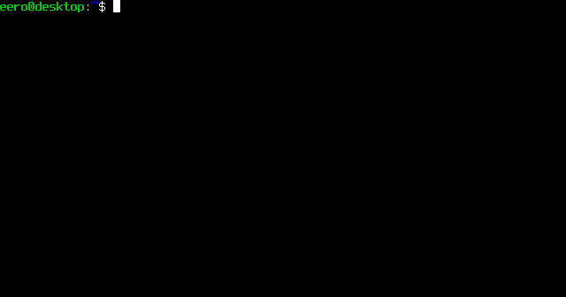

# Lie algebra gradings

This is a companion repository to the paper [Gradings for nilpotent Lie algebras](https://arxiv.org/abs/2011.06871) by Eero Hakavuori, Ville Kivioja, Terhi Moisala, and Francesca Tripaldi. The repository contains an implementation of the construction of stratifications, maximal gradings, and the enumeration of gradings for Lie algebras. It also includes a study of gradings for the nilpotent Lie algebra classifications of Cicalò-de Graaf-Schneider up to dimension 6 and Gong for dimension 7.

## Usage

### Prerequisites

A working installation of [SageMath](https://www.sagemath.org/) is needed. The code has been tested to work on version 9.0, released 2020-01-01.

### Clone

Clone the repo with
```shell
$ git clone https://github.com/ehaka/lie-algebra-gradings
```

### Test an example

Test any of the examples in the `examples` subfolder, for instance
```shell
$ cd lie-algebra-gradings
$ cd examples
$ sage second_heisenberg.sage
```

### Run the automated doctests (optional)

Most of the core functionality has automated tests. These can be run with the call
```
sage -t dim7/isom_utilities.py lie_gradings/classification/*.py lie_gradings/gradings/*.py
```

### The `lie_gradings` package

There is no separate installation, everything assumes that the package `lie_gradings` is found in `sys.path`. E.g. in `examples/second_heisenberg.sage` this is guaranteed with the preamble
```
import sys
import pathlib
path = pathlib.Path().absolute().parent
sys.path.append(str(path))
```
Here the assumption is that `pathlib.Path().absolute()` refers to the folder `lie-algebra-gradings/examples`, so the folder added to path is `lie-algebra-gradings`.

Note that `sys.path` when running Sage is different from `$PATH`.

### Use with Sage and the Sage notebook

The easiest way to use the package within Sage is to directly launch Sage in the main folder of the repo
```shell
$ cd lie-algebra-gradings
$ sage
```
Similarly for the Sage notebook

```shell
$ cd lie-algebra-gradings
$ sage --notebook=jupyter
```
Then the functions in the `lie_gradings` package can be imported with
```
sage: from lie_gradings import *
```

Otherwise, the repo folder can be added to `sys.path` for the duration of a Sage session with `sys.path.append('PATH-TO-LIE-ALGEBRA-GRADINGS-DIRECTORY')` command.


## Computing gradings for Lie algebras



The scripts in the `examples` subfolder demonstrate some of the basic functionality available. The basic structure of computations is the following.

First, import the contents of the `lie_gradings` package.
```
sage: from lie_gradings import *
```

Define a Lie algebra in Sage. The classifications of Cicalò-de Graaf-Schneider for dimensions 1-6 and of Gong for dimension 7 are implemented in `lie_gradings/classification`. For example the second Heisenberg Lie algebra is named L_{5,4} and can be constructed with coefficients in the field of algebraic numbers by
```
sage: L = d5.L5_4(QQbar)
```

The maximal grading of a Lie algebra can be computed using
```
sage: maximal_grading(L)
```

Some of the other main features are enumeration of torsion-free gradings by `torsion_free_gradings(L)` and computing a stratification if one exists by `stratification(L)`.

The documentation of the various functions can be accessed with the syntax
```
sage: maximal_grading?
```

## Data for nilpotent Lie algebras up to dimension 7

A listing of isomorphism classes of gradings for dimension up to 7 can be found in the `dim7/data` subfolder, along with the code used to construct the data in the `dim7` subfolder. Up to dimension 6 the data is a complete listing of all possible torsion-free gradings based on the classification of nilpotent Lie algebras up to dimension 6 by Cicalò-de Graaf-Schneider. In dimension 7, the data is a complete listing apart from the one-parameter families containing an uncountable number of Lie algebras, based on the classification of nilpotent Lie algebras in dimension 7 by Gong.

The gradings can be explored in html format within the files under `dim7/data/html` and various text format overviews are available in `dim7/data`.

The precomputed gradings and isomorphism classes can be accessed directly as Sage objects through the various files in the subfolders of `dim7/data/`. See the data access example in the `examples` directory for a sample how to load these files into Sage for further computations.

## Authors

* Eero Hakavuori
* Ville Kivioja
* Terhi Moisala
* Francesca Tripaldi

## License

This project is licensed under the MIT License - see the [LICENSE.txt](LICENSE.txt) file for details.
